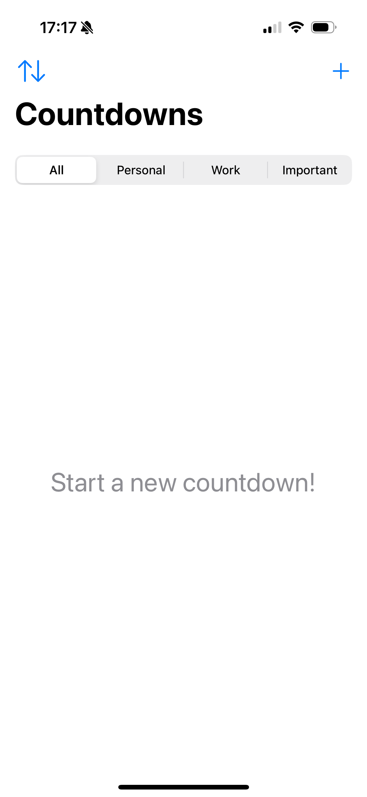
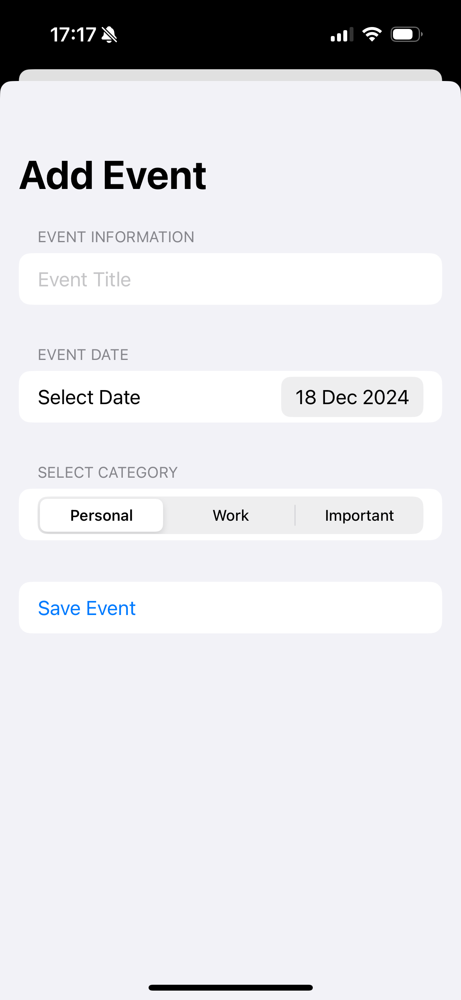
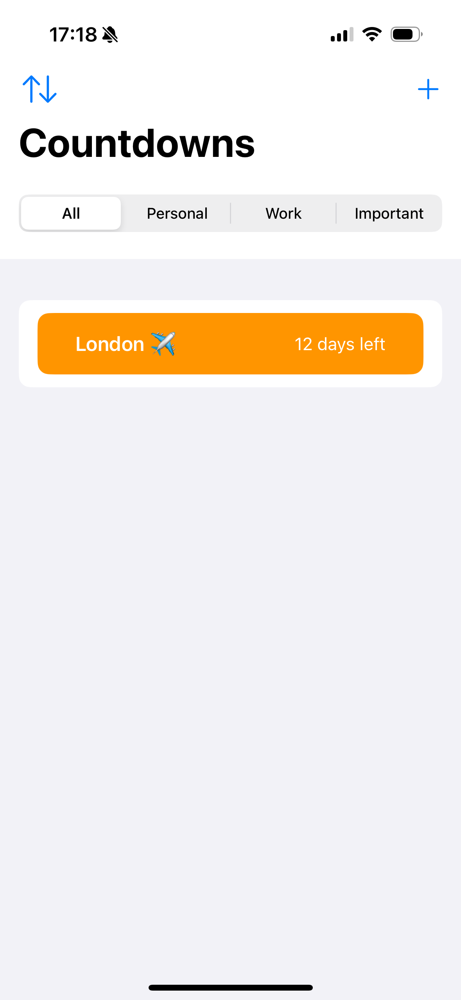
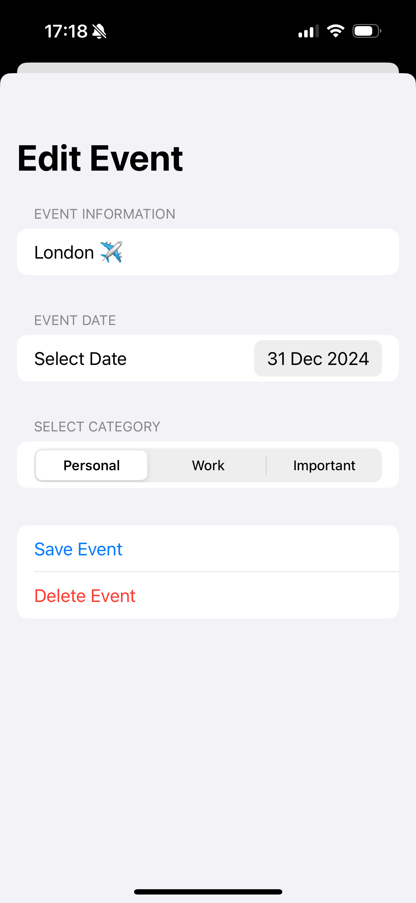

 

# Countdowns
Countdowns is an app designed to help you stay organized by managing your events and tasks. Easily add, edit, or delete events, and categorize them. It is perfect for keeping your schedule on track.
Countdowns App 📝

This is a simple iOS app built with Xcode that helps users staying organized by managing their events and tasks.

    

🚀Features
- Add, edit, and delete events
- Event filtering by category
- Event sorting by date
- Display of time remaining
- VoiceOver accessibility

🔨Installation
1. Clone this repository: `git clone https://github.com/giuliapiscitelli/Countdowns.git
2. Open the project in Xcode.
3. Run the app on a simulator or connected device.

📄License
This project is licensed under the MIT License.
